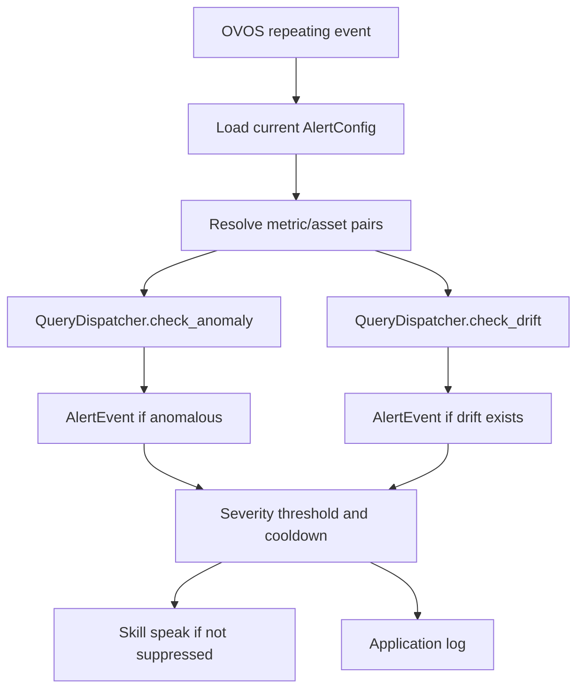

# AVAROS Alerts and Notification Boundary

Status: verified against AVAROS commit `8258ca95f61c17af444809f84e60ba55db941156`
Verification date: 2026-08-10

## Scope

This document describes the proactive anomaly/drift monitoring implemented in
AVAROS and the exact boundary of its current notification behavior. It does not
specify a future Reneryo notification protocol.

## Components

| Component | Responsibility |
|---|---|
| `AlertConfig` | Immutable domain configuration |
| `AlertMonitor` | Runs anomaly and drift checks, builds events, applies severity and cooldown suppression |
| AVAROS skill scheduler | Invokes the monitor and speaks/logs events |
| Alert configuration API | Reads and writes monitoring settings |
| `QueryDispatcher` | Collects adapter series and invokes PREVENTION client operations |
| `HttpPreventionClient` | Retrieves or derives analytical result data |

## Configuration contract

The API exposes `GET` and `PUT /api/v1/config/alert-config`. Both use this
schema:

| Field | Type/range | Default | Runtime meaning |
|---|---|---|---|
| `enabled` | boolean | `true` | Whether skill scheduling/checks are enabled |
| `interval_seconds` | integer 60–86400 | `14400` | Repeating OVOS event interval |
| `severity_threshold` | `none`, `low`, `medium`, `high`, `critical` | `medium` | Minimum severity eligible for speech |
| `cooldown_minutes` | integer 1–1440 | `60` | Suppression window for the same type/metric/asset |
| `monitored_pairs` | list of `{metric, asset_id}` | empty | Exact pairs; empty triggers auto-discovery |
| `z_score_threshold` | float 1.0–5.0 | `2.0` | Scheduled anomaly sensitivity |
| `query_z_score_threshold` | float 1.0–5.0 | `2.0` | Separate conversational anomaly sensitivity |

`SettingsService` stores all fields except `query_z_score_threshold` inside the
`alert_config` object. The conversational threshold is stored separately under
`query_anomaly_threshold`. On migration, it initially falls back to the alert
threshold until explicitly saved.

## Scheduler lifecycle

The skill starts the alert scheduler during skill initialization after the
dispatcher and adapter are initialized.

It does not schedule checks when:

- no dispatcher exists;
- the active adapter is `UnconfiguredAdapter`; or
- alert configuration is disabled.

Otherwise, it registers a repeating OVOS scheduled event named
`avaros_prevention_alert` with `frequency=config.interval_seconds` and handler
`_run_background_check`.

Changing the persisted interval does not directly reschedule an already
running event in the alert-config API route. The scheduler reads the interval
when it starts; the background handler reads the remaining current config on
each execution.

## Pair selection

For every run:

1. If `monitored_pairs` is nonempty, AVAROS checks exactly those valid persisted
   pairs.
2. Otherwise, it obtains `adapter.get_supported_metrics()` and
   `adapter.list_assets()` and constructs their Cartesian product.
3. If no metrics or assets resolve, the run ends without events.

The auto-discovery path can therefore attempt pairs that the upstream adapter
later rejects; each failed anomaly or drift operation is caught and logged by
`AlertMonitor`, and no event is emitted for that failed operation.

## Check pipeline



Each pair is checked sequentially by `AlertMonitor`. Both anomaly and drift are
attempted for every pair.

### Anomaly event

The monitor calls:

```text
QueryDispatcher.check_anomaly(metric, asset_id, config.z_score_threshold)
```

No event is built when `result.is_anomalous` is false. An event copies the
result severity and builds a message containing canonical metric display name,
asset ID, severity, and the first anomaly description when present.

### Drift event

The monitor calls:

```text
QueryDispatcher.check_drift(metric, asset_id)
```

No event is built when `result.has_drift` is false. Drift severity is derived as
implemented:

| Condition | Severity |
|---|---|
| Direction is not `degrading` | `low` |
| `degrading` and absolute rate >= 0.01 | `high` |
| `degrading` and absolute rate >= 0.003 but < 0.01 | `medium` |
| Other degrading rate | `low` |

The message includes canonical metric display name, asset ID, drift direction,
absolute rate formatted to four decimals per day, and an investigation prompt.

## Event model

An `AlertEvent` contains:

| Field | Meaning |
|---|---|
| `alert_type` | `anomaly` or `drift` |
| `metric` | `CanonicalMetric` |
| `asset_id` | Target asset ID |
| `severity` | `none`, `low`, `medium`, `high`, or `critical` |
| `message` | Human-oriented voice text |
| `detected_at` | UTC datetime |
| `suppressed` | Whether threshold/cooldown prevented speech |

This is an internal immutable Python domain object. It is not a documented JSON
transport type and is not returned by the FastAPI service.

## Suppression behavior

Severity order is `none < low < medium < high < critical`. An event is marked
suppressed if:

- its severity is below `severity_threshold`; or
- an unsuppressed event with the same key occurred within `cooldown_minutes`.

The cooldown key is:

```text
{alert_type}:{canonical_metric}:{asset_id}
```

Anomaly and drift cooldowns are independent because alert type is part of the
key. Only unsuppressed events update the last-alert timestamp.

Cooldown timestamps are held only in `AlertMonitor._last_alerts` memory. They
are lost when the skill process restarts or the `AlertMonitor` instance is
recreated.

## Delivery behavior

After a monitor run, the AVAROS skill:

1. calls `self.speak(event.message)` for every unsuppressed event;
2. logs every generated event, including suppressed events, with type, metric,
   asset, severity, and suppression state; and
3. logs aggregate generated/voiced counts.

`self.speak()` publishes through the OVOS runtime. A connected HiveMind browser
or widget may receive the resulting OVOS speech/message flow according to its
session and allowed message types. AVAROS does not target a specific Reneryo UI
instance from `AlertMonitor`.

## Persistence and retrieval boundary

At the verified commit:

- alert configuration is persisted;
- generated `AlertEvent` objects are not persisted;
- cooldown state is not persisted;
- events are not assigned a database ID;
- there is no alert history endpoint;
- there is no acknowledgement/read-state model;
- there is no retry or delivery-status record for speech;
- application logs are the only retained representation produced by this
  alert path, subject to deployment log retention.

Audit logs produced inside dispatcher analytics calls are separate query audit
records. They are not an alert event store.

## Reneryo integration boundary

The current AVAROS source contains no implemented:

- Reneryo notification API client;
- outbound Reneryo webhook call;
- generic webhook dispatcher;
- event queue/topic for alerts;
- Server-Sent Events stream;
- alert WebSocket channel;
- REST endpoint for listing or acknowledging alerts; or
- Reneryo UI notification payload/schema.

Therefore the only implemented proactive delivery behavior is OVOS speech plus
logging. The existing embeddable widget is a conversational HiveMind client; it
does not define a durable Reneryo notification feed.

## Failure behavior

An exception in an individual anomaly or drift check is caught, logged as a
warning, and yields no event for that operation. An exception escaping the
entire monitor invocation is caught by the skill scheduler and ends the run.
There is no externally visible failed-delivery event or retry queue.

If no PREVENTION client is configured, dispatcher anomaly/drift calls raise an
`AVAROSError`; scheduled per-pair checks catch it and produce no events. The
skill can remain usable for non-PREVENTION KPI operations.

## Source map

- Domain models: `skill/domain/alert_models.py`
- Monitoring/suppression: `skill/services/alert_monitor.py`
- Scheduler and delivery: proactive alert section of `skill/__init__.py`
- Settings persistence: alert config section of `skill/services/settings.py`
- HTTP configuration: `web-ui/routers/alerts.py`,
  `web-ui/schemas/alerts.py`
- Analytics orchestration: `skill/use_cases/query_dispatcher.py`
- PREVENTION client: `skill/clients/prevention_http.py`
- Tests: `tests/test_services/test_alert_monitor.py`,
  `tests/test_integration/test_alert_scheduler.py`,
  `tests/test_web_ui/test_alerts.py`
