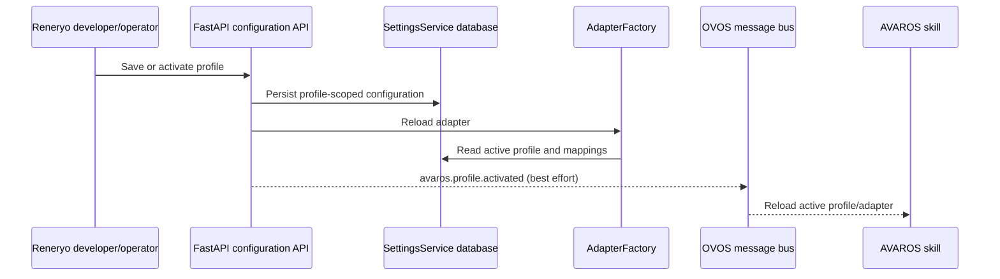
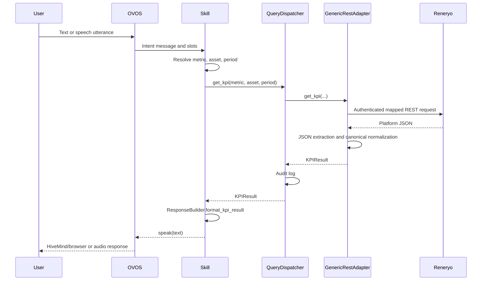
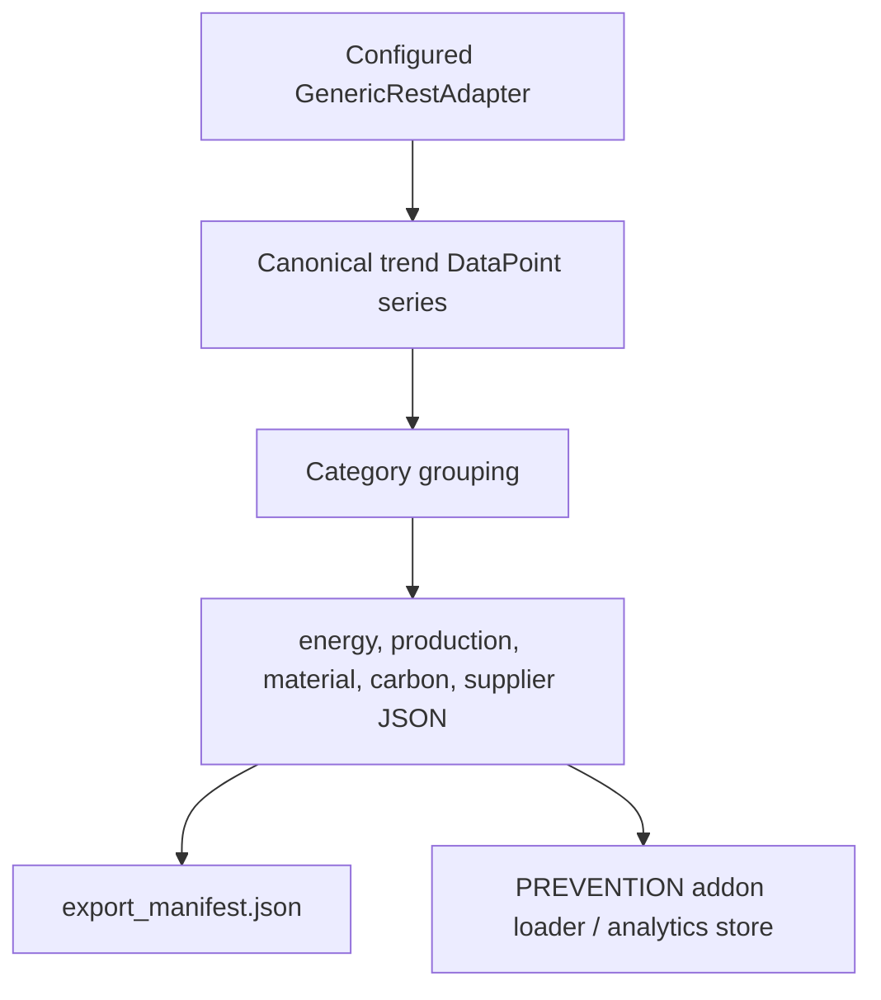

# AVAROS Data Lifecycle and Query Pipeline

Status: verified against AVAROS commit `8258ca95f61c17af444809f84e60ba55db941156`
Verification date: 2026-08-10

## Data classes

AVAROS handles four different classes of data:

| Data class | Origin | AVAROS use |
|---|---|---|
| Platform KPI/time series | Reneryo or another mapped REST platform | Direct KPI, comparison, trend, analytics input, KPI snapshots |
| Supplementary production data | FastAPI record/CSV input | Production totals, material efficiency, energy per unit and carbon derivations |
| Configuration | Web wizard/API and environment | Profiles, credentials, assets, metric mappings, intent state, emission factors, PREVENTION and alert settings |
| Analytics results | PREVENTION GraphQL | Anomaly, drift, and forecast result construction |

These classes do not share one universal payload. They are normalized at their
respective boundaries into immutable AVAROS domain/result models.

## Configuration lifecycle



The active profile contains the upstream base URL, credential, auth settings,
metric mappings, asset/resource links, and intent configuration. The factory
returns `UnconfiguredAdapter` when no real profile is active and
`GenericRestAdapter` for the registered `custom_rest` platform.

Platform credentials are stored through `SettingsService`; API responses mask
them. Profile-specific values are passed to the generic adapter when it is
created or reloaded.

## Reneryo mapping model

AVAROS uses two complementary mapping layers:

1. A metric mapping defines how to request and extract one canonical metric:
   endpoint template, JSON path, unit, and optional transform.
2. An asset mapping defines the asset identity and optional per-metric Reneryo
   resource IDs in `metric_resources`.

For the generator import, the input shape is:

```json
{
  "energy_per_unit": {
    "Line-1": "resource-uuid-1",
    "Line-2": "resource-uuid-2"
  }
}
```

and the persisted per-asset shape is equivalent to:

```json
{
  "Line-1": {
    "metric_resources": {
      "energy_per_unit": "resource-uuid-1"
    }
  }
}
```

The actual configured `mapping_output.json` is the runtime source for Reneryo
resource UUIDs. Documentation examples must not override that file.

## Request construction

`GenericRestAdapter` resolves a metric mapping and expands endpoint placeholders
using:

- `asset_id` / `assetid`;
- profile and per-asset extra settings, including resource IDs;
- `start_date`, `start_datetime`, `datetimemin`;
- `end_date`, `end_datetime`, `datetimemax`; and
- `period`, formatted as `<start>_<end>`.

Dates are rendered in UTC as `%Y-%m-%dT%H:%M:%SZ`. Query parameters embedded in
the endpoint template are split from the path before the HTTP request. Any
unresolved placeholder raises `GENERIC_REST_MAPPING_INVALID`; AVAROS does not
silently send unresolved templates upstream.

The adapter's HTTP layer applies the configured auth mode, timeout, retry count,
and backoff. Reneryo-specific auth and verified upstream endpoint behavior are
documented separately in `RENERYO-API-REFERENCE.md`.

## Direct KPI query lifecycle



A direct `KPIResult` contains the canonical metric, numeric value, unit,
asset ID, time period, and timestamp. Raw Reneryo JSON does not cross into the
intent handler.

## Adapter KPI behavior

For `get_kpi`, the generic adapter applies this order:

1. resolve a native asset/metric binding, if configured;
2. reject unsupported metrics for energy-only/native-limited assets;
3. require a canonical metric mapping;
4. resolve endpoint and query parameters using profile/asset settings;
5. call the upstream API with retry behavior;
6. extract the configured value using the mapping JSON path; and
7. return `KPIResult` with canonical metric/unit/context.

For comparison, the adapter fetches the selected metric separately for each
asset, ranks results according to metric direction semantics, and returns
`ComparisonResult`.

For trend, it resolves a trend request, extracts `DataPoint` values, calculates
direction and percentage change, and returns `TrendResult`. Empty extracted
series raise `GENERIC_REST_NO_DATA`.

`get_raw_data` returns the mapped upstream payload and is an internal adapter
contract. It is not exposed through FastAPI and is not directly spoken.

## Derived KPI lifecycle

`QueryDispatcher` derives selected KPIs only when the adapter does not report
the corresponding native capability and required services/data are present.

| Metric | Verified formula/input | Required data |
|---|---|---|
| `energy_per_unit` | `energy_total / total_produced` | Adapter `energy_total`; supplementary production summary with nonzero total |
| `material_efficiency` | `ProductionSummary.material_efficiency` | Supplementary production summary with nonzero total produced |
| `co2_total` | `energy_total * emission_factor` | Adapter `energy_total`; effective factor for primary energy source |
| `co2_per_unit` | `(energy_total * emission_factor) / total_produced` | Energy total, factor, nonzero production total |

`co2_per_batch` is included in the derived-carbon set, but the verified
dispatcher raises `MetricNotSupportedError` when native carbon is unavailable
because its required batch production derivation is not implemented.

Only `co2_total` trend derivation is implemented. It multiplies energy trend
points by the configured emission factor. Derived trends for `co2_per_unit` and
`co2_per_batch` are rejected.

If a native capability is present, the dispatcher uses the adapter result
instead of these local derivations.

## Supplementary production-data lifecycle

Production records enter through individual JSON requests or CSV upload and are
stored in the AVAROS database by `ProductionDataService`. Each record contains
date, asset, production count, good count, material consumption, shift, batch,
and notes.

For a requested asset and period, the service aggregates:

- total produced;
- total good;
- total material consumed;
- record count; and
- material efficiency.

The dispatcher rejects derivations that require production data when the
period's total production is zero. It does not fabricate a denominator or reuse
an unrelated period.

## Energy-only Reneryo assets

Live Reneryo SEUs may be represented as `energy_only` assets with a native
`energy_total` binding. For those assets:

- only the bound energy metric is reported as supported;
- comparison and trend are rejected by the generic adapter;
- `energy_per_unit` is rejected because production data is not bound to the
  meter; and
- an implicit total-energy request can use the configured aggregate period,
  while an explicit time period is rejected if the source mapping cannot carry
  time filters.

Generator-imported `Line-*` assets are separate full-KPI assets backed by
per-metric resource UUIDs. Live discovered SEUs and generator assets are not
silently treated as the same data source.

## Analytics data export to PREVENTION



The exporter:

1. resolves the configured active profile if no API URL is supplied;
2. lists configured assets and supported canonical metrics;
3. skips metric/asset pairs that require but lack a resource ID;
4. requests daily trend data for the configured lookback window;
5. falls back to `get_raw_data` only for adapters without the async trend
   contract;
6. converts values to canonical `DataPoint` records;
7. groups them into five category files; and
8. writes an export manifest used for freshness reporting.

The default Compose daemon interval is controlled by
`PREVENTION_EXPORT_INTERVAL_SECONDS` (default 900 seconds), and the default
lookback is `PREVENTION_EXPORT_DAYS` (30 days).

## PREVENTION result lifecycle

`HttpPreventionClient` queries PREVENTION at `<base-url>/graphql`. It discovers
capabilities using `allAnalysis` and requests precomputed result sets by
category-specific analytics goal.

PREVENTION uses a batch/precomputed model in this implementation. Although the
client interface receives the current adapter series, the normal successful
GraphQL request asks for a precomputed goal result; it does not upload those
data points in the query.

| Category | Anomaly goal | Drift goal | Forecast goal |
|---|---|---|---|
| Energy | `ENERGY_ANOMALY_CHECK` | `ENERGY_DRIFT_CHECK` | `ENERGY_FORECAST` |
| Production | `PRODUCTION_ANOMALY_CHECK` | `PRODUCTION_DRIFT_CHECK` | `PRODUCTION_FORECAST` |
| Material | `MATERIAL_ANOMALY_CHECK` | `MATERIAL_DRIFT_CHECK` | `MATERIAL_FORECAST` |
| Carbon | `CO2_ANOMALY_CHECK` | `CO2_DRIFT_CHECK` | `CO2_FORECAST` |
| Supplier | `SUPPLIER_ANOMALY_CHECK` | `SUPPLIER_DRIFT_CHECK` | `SUPPLIER_FORECAST` |

On anomaly GraphQL query failure, the HTTP client invokes its implemented local
series-analysis fallback. Drift and forecast behavior is defined in their
client methods and corresponding tests; no caller should infer live streaming
analytics from this batch contract.

## KPI measurement lifecycle

The FastAPI service starts `KPIScheduler` on application startup. It performs a
bootstrap task and a repeating collection task:

- seed missing baselines;
- backfill snapshots from available trend history;
- realign baselines to the earliest snapshot where applicable;
- collect current snapshots; and
- retry failures up to three times with exponential backoff.

Baselines and snapshots are stored by `KPIMeasurementService` and exposed
through `/api/v1/kpi/*`. This measurement subsystem is distinct from the
conversational query pipeline; querying AVAROS does not require a KPI snapshot
record to exist.

## Audit data

`QueryDispatcher` generates a query UUID and calls `AuditLogger` after completed
operations. The audit record includes operation, query ID, metric, asset/context,
and a summarized result. Audit logging is not the same as an alert-event store
or a Reneryo notification feed.

## Source map

- Profile/config persistence: `skill/services/settings.py`,
  `skill/services/profiles.py`, `web-ui/routers/config.py`,
  `web-ui/routers/profiles.py`
- Adapter factory: `skill/adapters/factory.py`
- Reneryo/generic REST mapping and HTTP: `skill/adapters/generic_rest/`
- Canonical models/results: `skill/domain/models.py`, `skill/domain/results.py`
- Orchestration/derivation: `skill/use_cases/query_dispatcher.py`,
  `skill/services/co2_service.py`, `skill/services/production_data.py`
- PREVENTION export: `tools/prevention-data-sync/exporter.py`
- PREVENTION query client: `skill/clients/prevention_http.py`
- KPI measurement: `web-ui/services/kpi_collector.py`,
  `web-ui/services/kpi_scheduler.py`, `skill/services/kpi_measurement.py`
- Tests: `tests/test_adapters/`, `tests/test_integration/`,
  `tests/test_use_cases/`, `tests/test_services/`
