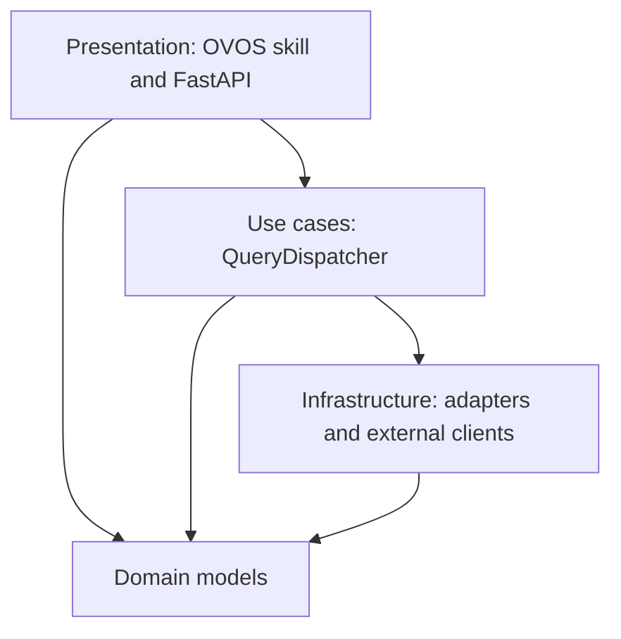

# AVAROS System Architecture

Status: verified against AVAROS commit `8258ca95f61c17af444809f84e60ba55db941156`
Verification date: 2026-08-10

## Architectural boundaries

AVAROS is an OVOS skill plus supporting services. The skill owns natural-
language behavior and manufacturing query orchestration. The FastAPI service
owns configuration and operational APIs and serves the React UI. Platform-
specific response shapes are isolated in the adapter layer. Canonical domain
models do not depend on Reneryo, FastAPI, OVOS, or PREVENTION.

The implemented dependency direction is:

The domain layer is in `skill/domain/`; orchestration is primarily
`skill/use_cases/query_dispatcher.py`; adapters are under `skill/adapters/`;
OVOS presentation is in `skill/`; and the HTTP presentation layer is in
`web-ui/`.

## Runtime components

| Component | Implementation | Responsibility | Persistent state |
|---|---|---|---|
| AVAROS skill | `launch_skill.py`, `skill/` | OVOS intent registration, fallback handling, query dispatch, response speech, proactive alert scheduling | Reads shared AVAROS DB; audit output is file/log based |
| OVOS message bus | pinned `smartgic/ovos-messagebus` image | OVOS event transport | Compose volume/config as declared |
| OVOS core | pinned `smartgic/ovos-core` image | Intent pipeline and voice-assistant runtime | `ovos-config` volume |
| FastAPI + React | `web-ui/` | Configuration UI/API, status, voice config/TTS, asset and metric configuration, production data, KPI progress, proxy routes | Shared AVAROS DB |
| HiveMind | HiveMind container in Compose | Browser-to-OVOS WebSocket gateway | HiveMind data/state volumes where declared |
| Wake-word service | `services/wakeword/` | Browser audio wake-word detection | No application DB |
| Generic REST adapter | `skill/adapters/generic_rest/` | Profile-driven upstream HTTP calls and canonical result conversion | Reads active profile settings |
| PREVENTION exporter | `tools/prevention-data-sync/exporter.py` | Periodically exports normalized time series into category JSON files and a manifest | Mounted PREVENTION addon data directory |
| PREVENTION client | `skill/clients/prevention_http.py` | Reads precomputed analytics from PREVENTION GraphQL | PREVENTION owns its analytics store |
| Demo platform | `tools/reneryo-data-generator/` | Deterministic evaluation/training data source | Demo-only |

## Standalone deployment

The supported root `docker-compose.yml` includes:

- `avaros`
- `ovos_messagebus`
- `ovos-core`
- `avaros-web-ui`
- `avaros-prevention-exporter`
- `avaros-wakeword`
- `hivemind`
- optional profile `demo-platform`

The skill and FastAPI service share `sqlite:////data/avaros.db` through the
`avaros-data` volume. The Web UI binds to loopback by default at host port
`${AVAROS_WEB_PORT:-8080}`. The skill is a message-bus client and does not
serve HTTP.

## WASABI/OVOS integration deployment

`docker/docker-compose.avaros.yml` supplies the AVAROS services for an external
WASABI OVOS environment. It declares a PostgreSQL service and includes the
AVAROS skill, Web UI, PREVENTION exporter, wake-word service, HiveMind, proxy,
and certificate support. It expects the external WASABI `ovos` network and an
external OVOS service as described by `user-docs/INSTALLATION.md`.

This mode is distinct from the root standalone Compose stack. Container and
network details must be read from the Compose file used for the deployment.

## Optional PREVENTION deployment

`docker/docker-compose.prevention.yml` defines a separate PREVENTION and MongoDB
stack. The main AVAROS repository does not bundle a production PREVENTION
platform image; the Compose file builds from the external path configured by
`PREVENTION_BUILD_CONTEXT`.

AVAROS remains operational for configured platform KPI queries when PREVENTION
is absent. PREVENTION-dependent analytics are unavailable in that state.

## Configuration and state ownership

`SettingsService` is the shared configuration boundary. Its production URL is
resolved from `AVAROS_DATABASE_URL`; tests may use SQLite/in-memory databases.
The service stores profile-scoped configuration and emits best-effort entity
refresh notifications to OVOS where implemented.

| State | Owner |
|---|---|
| Active profile and platform credentials | `SettingsService` |
| Metric mappings | Active profile in `SettingsService` |
| Asset mappings/resource links | Active profile in `SettingsService` |
| Intent activation and action bindings | Active profile in `SettingsService` |
| Emission factors | `SettingsService` |
| PREVENTION configuration | Environment override and/or `SettingsService`, resolved by `prevention_runtime.py` |
| Alert configuration | `SettingsService` |
| Production records | AVAROS database via `ProductionDataService` |
| KPI baselines and snapshots | AVAROS database via `KPIMeasurementService` |
| Alert cooldown timestamps | In-memory `AlertMonitor._last_alerts` only |
| PREVENTION export files/manifest | PREVENTION addon mounted data directory |

## External network paths

| Direction | Protocol | Path/purpose |
|---|---|---|
| Browser -> FastAPI | HTTP(S) | React assets, configuration API, TTS, health |
| Browser -> FastAPI -> HiveMind | WebSocket | `/hivemind/` same-origin proxy |
| Browser -> FastAPI -> wake-word service | HTTP/WebSocket | `/wakeword/health`, `/wakeword/ws/detect` |
| HiveMind/OVOS -> AVAROS skill | OVOS message bus | Utterances, intent events, skill speech responses |
| AVAROS adapter -> Reneryo | HTTP(S) REST | Profile and metric-mapping-defined requests |
| Exporter -> Reneryo | HTTP(S) REST | Historical trend/raw data collection through adapter |
| AVAROS skill/FastAPI -> PREVENTION | HTTP(S) GraphQL | Health/capability probe and analytics result queries |

## Trust and authentication boundaries

- FastAPI applies `X-API-Key` authentication only to paths beginning with
  `/api/v1/`.
- `/health`, FastAPI documentation/schema paths, SPA assets, `/hivemind/`,
  `/wakeword/*`, `/voice/preferences`, and `/voice/tts` are outside that API-key
  middleware condition. Their individual behavior is described in the API
  reference.
- HiveMind requires its `authorization` WebSocket query parameter. The FastAPI
  proxy forwards it as `X-HiveMind-Auth` to the backend.
- Upstream platform authentication is profile-scoped. The generic REST adapter
  supports the auth modes implemented by its HTTP mixin and configured by the
  wizard; the Reneryo deployment uses the verified cookie configuration
  documented in `RENERYO-API-REFERENCE.md`.
- The current embeddable widget exposes its HiveMind client keys to the browser
  and is therefore restricted to trusted internal hosts.

## Hot-reload behavior

Profile activation through `POST /api/v1/config/profiles/{name}/activate`:

1. validates that the profile exists, uses a registered adapter, and has an API
   URL when configured;
2. records the new active profile;
3. reloads the FastAPI-side adapter factory;
4. rolls back the active profile if adapter creation fails; and
5. sends a best-effort `avaros.profile.activated` event to the OVOS message bus.

Failure to notify the voice skill does not roll back successful activation;
the response field `voice_reloaded` reports whether the event was sent.

## Source map

- Deployment: `docker-compose.yml`, `docker/docker-compose.avaros.yml`,
  `docker/docker-compose.prevention.yml`
- FastAPI assembly/auth: `web-ui/main.py`
- Dependency construction: `web-ui/dependencies.py`, `skill/__init__.py`
- Profiles/hot reload: `web-ui/routers/profiles.py`,
  `skill/adapters/factory.py`, `skill/services/profiles.py`
- Domain contract: `skill/domain/`
- Runtime interfaces: `skill/adapters/base.py`,
  `skill/clients/prevention.py`
